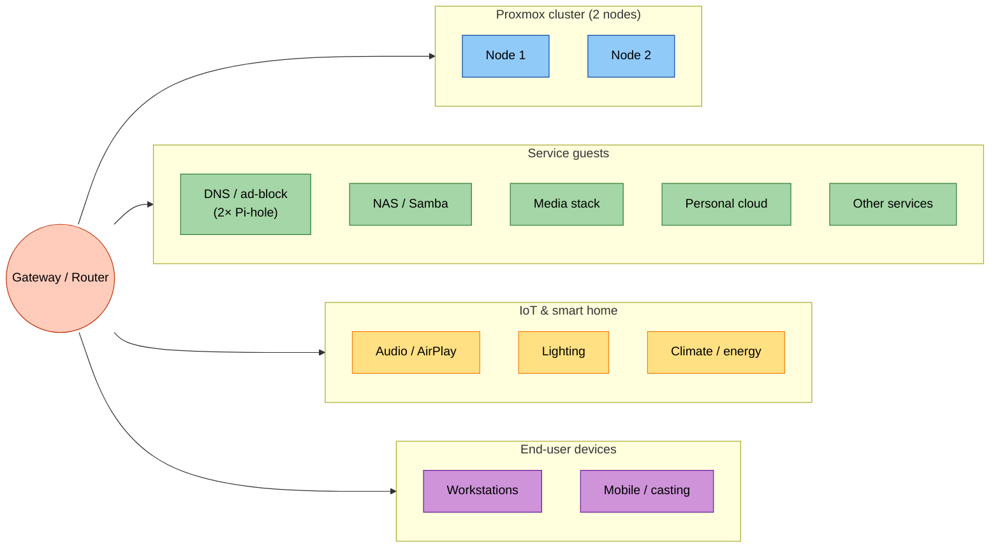
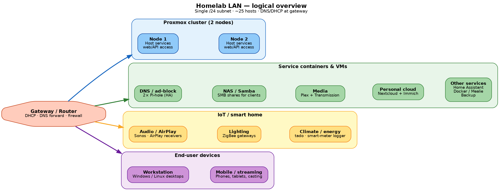

# Proxmox VE 9 — Homelab Infrastructure Documentation

> **Public / GitHub version** — sanitised for public sharing. Sensitive details (real IPs, MAC addresses, hostnames where applicable) are replaced with placeholders. Maintain the full internal version separately.

| | |
|---|---|
| **Maintainer** | `<MAINTAINER>` |
| **Repository** | `<REPO-URL>` |
| **Last updated** | 16 May 2026 |
| **Document version** | 1.0 |
| **Proxmox VE version** | 9.1.9 (`pve-manager/9.1.9/ee7bad0a3d1546c9`) |
| **Kernel** | 7.0.2-2-pve |
| **Cluster name** | `<CLUSTER-NAME>` |

---

## Table of contents

1. [Overview](#1-overview)
2. [Architecture](#2-architecture)
3. [Storage](#3-storage)
4. [Compute inventory](#4-compute-inventory)
5. [Networking](#5-networking)
6. [SMB / NAS layer](#6-smb--nas-layer)
7. [Operational runbook](#7-operational-runbook)
8. [Change log & known issues resolved](#8-change-log--known-issues-resolved)
9. [Explain like I'm 5](#9-explain-like-im-5)
10. [References](#10-references)
11. [Appendices](#11-appendices)

---

## 1. Overview

A two-node Proxmox VE 9 cluster runs a mix of LXC containers and KVM virtual machines for a self-hosted homelab. The platform hosts file sharing (SMB/CIFS), media streaming, torrent download, DNS ad-blocking, smart home automation, photo backup and collaboration tooling.

### Why Proxmox VE?

Proxmox VE is a Debian-based open-source virtualisation platform that combines KVM hypervisor (for full VMs) and LXC (for lightweight Linux containers) under a single web UI and API, with built-in support for ZFS, Ceph and clustering. It avoids the licensing model of VMware while providing comparable enterprise features (live migration, HA, replication, snapshots).

### Why ZFS?

ZFS provides end-to-end checksumming (silent corruption detection), copy-on-write snapshots, compression (LZ4 by default), and the ability to expand pools online. RAIDZ expansion landed in upstream OpenZFS and is supported in PVE 9, which is useful for future capacity growth.

### Why LXC over VMs for most workloads?

LXC containers share the host kernel and avoid the overhead of a full guest OS, making them faster, lighter and quicker to boot than KVM VMs. For workloads that don't need a separate kernel (most Linux services), LXC is the obvious choice. VMs remain in use for appliances that bundle their own OS image (e.g. Home Assistant OS, Nextcloud appliance).

---

## 2. Architecture

### Physical hardware

Both nodes are **HPE ProLiant MicroServer Gen10** units (AMD platform — not Gen10 Plus):

| Component | Specification |
|---|---|
| CPU | AMD Opteron X3421 APU — 4 cores @ 2.1 GHz base / 3.4 GHz turbo, integrated Radeon R7 graphics |
| RAM | 16 GB (DDR4 ECC SO-DIMM) |
| Drive bays | 4 × 3.5" SATA |
| On-board NICs | Dual-port 1 GbE (Broadcom) |
| Add-in NIC | Dual-port 1 GbE in PCIe slot (visible as `enp2s0f0/f1` on pve, `enp3s0f0/f1` and `ens2f0/f1` on pve2) |
| Display | 2 × DisplayPort, 1 × VGA |
| USB | 4 × USB 3.0, 2 × USB 2.0 |
| Boot | **UEFI** (EFI System Partition on ESP, root on LVM-thin) |
| Out-of-band management | None (Gen10 non-Plus has no iLO) |

The AMD APU is significant for the Immich container — the integrated Radeon GPU is passed through to CT 112 for hardware-accelerated photo/video transcoding (`/dev/dri/card1`, `/dev/dri/renderD128`).

### Cluster layout

```mermaid
flowchart TB
    classDef node fill:#E8F0FE,stroke:#1A73E8,stroke-width:2px,color:#000
    classDef vm fill:#FCE8E6,stroke:#D93025,stroke-width:1px,color:#000
    classDef ct fill:#E6F4EA,stroke:#188038,stroke-width:1px,color:#000
    classDef storage fill:#FEF7E0,stroke:#F9AB00,stroke-width:2px,color:#000
    classDef hw fill:#F1F3F4,stroke:#5F6368,stroke-width:1px,color:#000

    subgraph Cluster["Proxmox Cluster: &lt;CLUSTER-NAME&gt; — PVE 9.1.9"]
      direction LR

      subgraph PVE["Node: pve (&lt;PVE-IP&gt;/24)"]
        direction TB
        PVEHW["🖥️ HP MicroServer Gen10<br/>AMD Opteron X3421 · 16 GB RAM<br/>UEFI boot"]:::hw
        TANK[("💾 ZFS pool: tank<br/>~41 TB · 21.72% used")]:::storage
        VM111["VM 111 — mweelrea<br/>Nextcloud"]:::vm
        CT101["CT 101 — oriel<br/>NAS / Samba"]:::ct
        CT102["CT 102 — slemish<br/>Plex"]:::ct
        CT103["CT 103 — iveagh<br/>Transmission"]:::ct
        CT106["CT 106 — commedagh<br/>Pi-hole (pri.)"]:::ct
      end

      subgraph PVE2["Node: pve2 (&lt;PVE2-IP&gt;/24)"]
        direction TB
        PVE2HW["🖥️ HP MicroServer Gen10<br/>AMD Opteron X3421 · 16 GB RAM<br/>UEFI boot"]:::hw
        TANK2[("💾 ZFS pool: tank2<br/>~10 TB · 1.25% used")]:::storage
        VM113["VM 113 — breifne<br/>Home Assistant"]:::vm
        CT104["CT 104 — donard<br/>Pi-hole (sec.)"]:::ct
        CT108["CT 108 — slievemore<br/>Backup"]:::ct
        CT109["CT 109 — knockbrinnea<br/>Docker / Mealie"]:::ct
        CT112["CT 112 — immich<br/>Photos (GPU passthrough)"]:::ct
      end

      PVE <-. "Corosync · knet<br/>quorum 2/2" .-> PVE2
    end

    class PVE,PVE2 node
```



### Key design decisions

- **Two-node cluster, no shared storage.** Each node has its own ZFS pool. Storage is **not** shared across nodes — `tank` is defined with `nodes pve`, `tank2` with `nodes pve2`. Live migration between nodes requires `qm migrate` with storage relocation, not seamless shared-storage migration.
- **Quorum from 2 votes.** Both nodes must be online for the cluster to be quorate. There is no dedicated QDevice/witness. A single-node failure leaves the surviving node read-only for cluster operations until quorum is restored manually (`pvecm expected 1`).
- **Unprivileged containers by default.** All LXC containers run with user-namespace remapping (container UID 0 → host UID 100000), which substantially reduces blast radius if a container is compromised. Privileged containers are avoided unless a workload absolutely requires it.
- **DNS redundancy.** Two Pi-hole instances (one per node) provide DNS ad-blocking with no single point of failure.
- **Service segmentation by hostname.** Containers are named after mountains/landmarks in Ireland (oriel, slemish, iveagh, donard, commedagh, slievemore, knockbrinnea, breifne, mweelrea) — a memorable scheme that decouples hostname from function.

---

## 3. Storage

### Storage pools

| Storage ID | Type | Node | Total | Used | Purpose |
|---|---|---|---|---|---|
| `tank` | ZFS pool | pve | ~41 TB | 21.72% | Primary bulk data — media, downloads, NAS |
| `tank2` | ZFS pool | pve2 | ~10 TB | 1.25% | Secondary bulk data, backups, Immich storage |
| `vmstorage` | ZFS sub-config of `tank` | pve | (shared with tank) | — | Sparse=0 VM/CT disks |
| `vmstoragelimited` | ZFS sub-config of `tank` | pve | (shared with tank) | — | Quota-limited VM/CT disks |
| `vmstorage2` | ZFS sub-config of `tank2` | pve2 | (shared with tank2) | — | Sparse=0 VM/CT disks |
| `vmstoragelimited2` | ZFS sub-config of `tank2` | pve2 | (shared with tank2) | — | Quota-limited VM/CT disks |
| `local-lvm` | LVM-thin | both | ~800 GB (pve) / 140 GB (pve2) | <10% | Local OS-disk VM/CT disks |
| `local` / `iso` | Directory | both | — | — | ISO images and CT templates |
| `zfs_backup` | Directory | pve2 | (on tank2) | — | vzdump backup target |

**Note:** `vmstorage` and `vmstoragelimited` are not separate physical pools — they are alternative Proxmox storage IDs that point at the same underlying ZFS pool (`tank` on pve, `tank2` on pve2) with different `sparse` and quota behaviour. This pattern lets you assign different policies to different VMs/CTs without managing separate pools.

### ZFS datasets on `tank` (pve)

| Dataset | Mountpoint | Purpose |
|---|---|---|
| `tank/Downloads` | `/tank/Downloads` | Samba "Downloads" share, Transmission target |
| `tank/Media` | `/tank/Media` | Samba "Media" share, Plex library |
| `tank/scratch` | `/tank/scratch` | Temporary working area |
| `tank/storage` | `/tank/storage` | Samba "storage" share, general-purpose |

### Backup strategy

- **vzdump** is configured to write to the `zfs_backup` directory storage on pve2, which sits on the `tank2` ZFS pool at `/tank2/backups/dump`.
- This was migrated from `/tank/backups` during the PVE 9 upgrade preparation (root filesystem was running low on space — see §8).
- Backups retain all snapshots (`prune-backups keep-all=1`) and are not currently age-pruned. This is a known item to revisit when `tank2` utilisation grows.

---

## 4. Compute inventory

### Virtual machines

| VMID | Name | Node | Purpose | vCPU | RAM | Disk(s) | BIOS | Notes |
|---|---|---|---|---|---|---|---|---|
| 111 | mweelrea | pve | Nextcloud | 2 | 4 GB | 40 GB + 828 MB on local-lvm | SeaBIOS, q35 | Community Scripts appliance, qemu-guest-agent enabled |
| 113 | breifne | pve2 | Home Assistant OS 17.2 | 2 | 4 GB | 32 GB on vmstorage2 | OVMF (UEFI) | HA Core 2026.4.1 |

### LXC containers

| CTID | Hostname | Node | Purpose | OS | vCPU | RAM | Rootfs |
|---|---|---|---|---|---|---|---|
| 101 | oriel | pve | NAS / Samba | Debian | 2 | 512 MB | local-lvm 8 GB |
| 102 | slemish | pve | Plex Media Server | Debian | 4 | 4 GB | local-lvm 28 GB |
| 103 | iveagh | pve | Transmission | Debian | 1 | 256 MB | vmstorage 8 GB |
| 106 | commedagh | pve | Pi-hole DNS (primary) | Debian | 1 | 256 MB | vmstorage 4 GB |
| 104 | donard | pve2 | Pi-hole DNS (secondary) | Debian | 1 | 256 MB | vmstorage2 4 GB |
| 108 | slievemore | pve2 | Backup server | Debian | 2 | 4 GB | vmstorage2 100 GB |
| 109 | knockbrinnea | pve2 | Docker host + Mealie | Ubuntu | 2 | 1 GB | vmstorage2 50 GB |
| 112 | immich | pve2 | Self-hosted photos (Immich) | Debian | 4 | 4 GB | tank2 600 GB |

All LXC containers are **unprivileged** (UID-remapped). Specific feature flags are enabled per-container as needed:

- **CT 109** (Docker): `features: keyctl=1,nesting=1` — required for Docker-in-LXC.
- **CT 112** (Immich): `features: keyctl=1,nesting=1,fuse=1` plus GPU passthrough (`dev0: /dev/dri/card1`, `dev1: /dev/dri/renderD128`, `lxc.cgroup2.devices.allow: c 10:200 rwm`) for hardware-accelerated transcoding.

### Container 101 (oriel / NAS) mount points

| Host path | Container path | Purpose |
|---|---|---|
| `/tank/scratch` | `/mnt/scratch` | Temporary files |
| `/tank/Media` | `/mnt/media` | Media library (also exported as SMB "Media") |
| `/tank/Downloads` | `/mnt/downloads` | Downloads (also exported as SMB "Downloads") |
| `/tank/storage` | `/mnt/storage` | General storage (also exported as SMB "storage") |

### Boot order

Defined via `startup: order=N,up=N,down=N` in each container/VM config:

| Order | Service | Rationale |
|---|---|---|
| 1 | CT 101 (NAS), CT 106 (Pi-hole pri.) | File services and DNS must be up before dependents start |
| 2 | CT 102 (Plex) | Needs `/mnt/media` from the NAS once available |
| 3 | CT 103 (Transmission) | Needs `/mnt/downloads` and `/mnt/media` |
| 4 | VM 111 (Nextcloud) | Application layer |

---

## 5. Networking

## 5. Networking

### LAN topology (logical)





*Figure 2 — High-level view of network roles. See the internal documentation for host-level detail.*

### IP plan (sanitised)

| Host | Role | Notes |
|---|---|---|
| `<PVE-IP>` | pve node management | Static, `vmbr0` |
| `<PVE2-IP>` | pve2 node management | Static, `vmbr0` |
| `<NAS-IP>` | CT 101 oriel (Samba) | Static |
| `<PIHOLE-PRI>` | CT 106 commedagh (DNS) | Static |
| `<PIHOLE-SEC>` | CT 104 donard (DNS) | Static |
| DHCP | CT 112 immich, VM 111 mweelrea | Reserved leases |

All hosts sit on a single flat `/24` subnet. Future improvement: VLAN segmentation for management vs services vs IoT.

### Bridge configuration

**pve** uses a bridge with **two bridge ports**:

```bash
auto vmbr0
iface vmbr0 inet static
    address <PVE-IP>/24
    gateway <GATEWAY>
    bridge-ports enp2s0f0 enp2s0f1
    bridge-stp off
    bridge-fd 0
```

This is **not** a bond — both physical ports are added to the bridge directly, which means STP would normally be required to avoid loops. With `bridge-stp off`, this only works safely if the two ports are connected to different switches or VLANs, or one is unused. **Verify cabling.** If both are connected to the same switch without LACP or STP, this will cause a broadcast storm.

**pve2** uses a simpler single-port bridge:

```bash
auto vmbr0
iface vmbr0 inet static
    address <PVE2-IP>/24
    gateway <GATEWAY>
    bridge-ports enp3s0f1
    bridge-stp off
    bridge-fd 0
```

### Cluster network

Corosync uses `knet` transport with secure authentication enabled. Both nodes participate in `Ring ID 1`. Cluster traffic shares the management network (no dedicated corosync ring) — adequate for two nodes on a quiet LAN, but a second ring on a separate NIC would be best practice.

---

## 6. SMB / NAS layer

### Samba shares (`/etc/samba/smb.conf` on CT 101)

| Share | Path inside CT | Backing dataset | Valid users |
|---|---|---|---|
| `Media` | `/mnt/media` | `tank/Media` | `@doctor doctor` |
| `Downloads` | `/mnt/downloads` | `tank/Downloads` | `@doctor doctor` |
| `storage` | `/mnt/storage` | `tank/storage` | `@doctor doctor` |

Global Samba settings of note:
- `server role = standalone server`
- `usershare allow guests = yes`
- `map to guest = Bad User`
- `unix password sync = yes`

### Unprivileged container UID mapping

This is the single most important thing to understand about file ownership on the NAS.

By default an unprivileged LXC remaps UID 0 inside the container to UID 100000 on the host. The user `doctor` (UID 1000 inside the container) is therefore UID **101000** on the host.

If files on `/tank/...` are owned by host UID 65534 (`nobody`) or by host root, the container user sees them as `nobody:nogroup` and cannot write to them. The fix is to set ownership on the **host** to `101000:101000`:

```bash
# Run on the host (pve), not inside the container
chown -R 101000:101000 /tank/Downloads /tank/Media /tank/scratch /tank/storage
```

After this, `ls -l /mnt/...` inside CT 101 shows `doctor:doctor` and writes succeed.

### Client-side mount example (Linux / Fedora)

```bash
# /etc/fstab — replace <NAS-IP> with the NAS container IP
//<NAS-IP>/Downloads  /mnt/downloads  cifs  credentials=/etc/samba/.creds,uid=1000,gid=1000,file_mode=0664,dir_mode=0775,vers=3.0,nounix,noserverino,nobrl,_netdev,x-systemd.automount  0  0
//<NAS-IP>/Media      /mnt/media      cifs  credentials=/etc/samba/.creds,uid=1000,gid=1000,file_mode=0664,dir_mode=0775,vers=3.0,nounix,noserverino,nobrl,_netdev,x-systemd.automount  0  0
//<NAS-IP>/storage    /mnt/storage    cifs  credentials=/etc/samba/.creds,uid=1000,gid=1000,file_mode=0664,dir_mode=0775,vers=3.0,nounix,noserverino,nobrl,_netdev,x-systemd.automount  0  0
```

**Critical mount options** and why each one matters:

| Option | Why |
|---|---|
| `credentials=` | Path to a `chmod 600` file containing `username=` and `password=` — keeps creds out of fstab and process listings |
| `uid=1000,gid=1000` | Maps server-side ownership to the local user on the client |
| `vers=3.0` | Forces SMB3 — faster, encrypted-capable, no SMB1 attack surface |
| `nounix` | Disables Unix extensions — **required for ZFS-backed shares**, prevents server-mapped permissions from clashing with the client's view |
| `noserverino` | Uses client-side inode numbers — fixes spurious "out of space" reports on ZFS |
| `nobrl` | Disables byte-range locking — fixes write errors with large files (sqlite, torrent, photo apps) |
| `_netdev` | Tells systemd this is a network mount — defers until network is up |
| `x-systemd.automount` | Lazy-mounts on first access — boot doesn't block on the NAS being up |

The credentials file format is critical: **no quoting, no escaping**. If the password contains spaces, write the literal spaces:

```ini
# /etc/samba/.creds  (chmod 600)
username=doctor
password=My Plain Text Password
```

`\040` escapes work in fstab (e.g. for paths with spaces) but **not** inside the credentials file, and not on the command line.

---

## 7. Operational runbook

### Updates and patching

Patching across the host and all containers/VMs is automated with the **BassT23 Proxmox Updater** (currently version 4.5.2):

- Repository: <https://github.com/BassT23/Proxmox>
- Script: `Update-All.sh`
- What it does: updates the PVE host(s), then iterates through every running container and VM and runs the appropriate package manager (`apt`, `yum/dnf`, etc.) inside each guest. Optional Slack/Telegram notifications. Snapshot-before-update support.
- Cadence: monthly manual run plus on-demand before any infrastructure change.

```bash
# Typical invocation
bash <(curl -fsSL https://raw.githubusercontent.com/BassT23/Proxmox/main/Update-All.sh)
```

### Daily checks

```bash
# Cluster health
pvecm status

# Storage utilisation
pvesm status
zpool status
zpool list

# Running guests
qm list
pct list

# Recent errors
journalctl -p err -b
```

### Adding a new dataset and exporting it as SMB

```bash
# On the host (pve):
zfs create tank/newshare
chown -R 101000:101000 /tank/newshare       # so unprivileged CT 101 can write
pct set 101 -mp4 /tank/newshare,mp=/mnt/newshare
pct reboot 101
```

Then on CT 101, add a `[newshare]` block to `/etc/samba/smb.conf` and `systemctl reload smbd`.

### Snapshot before a risky change

```bash
# Container / VM snapshot via Proxmox (preferred — includes config)
pct snapshot 101 before-change
qm snapshot 111 before-change

# Or ZFS-level snapshot of a dataset
zfs snapshot tank/storage@$(date +%Y%m%d-%H%M%S)
```

### Migrating a guest between nodes

Because storage is **not shared**, online migration requires copying disks:

```bash
# Live migrate VM 111 from pve to pve2 (relocates disks via vmstorage2)
qm migrate 111 pve2 --online --with-local-disks --targetstorage vmstorage2

# Containers cannot live-migrate; they require restart-migrate
pct migrate 101 pve2 --restart --target-storage vmstoragelimited2
```

### Stale lock recovery

```bash
# If a Proxmox task hangs and leaves a stale lock:
rm /var/lock/qemu-server/lock-<VMID>.conf      # for VMs
rm /var/lock/lxc/pve-config-<CTID>.lock        # for CTs
```

---

## 8. Change log & known issues resolved

### May 2026 — Upgrade from PVE 8.4 to PVE 9.1.9

Both nodes upgraded following the [official PVE 8→9 upgrade guide](https://pve.proxmox.com/wiki/Upgrade_from_8_to_9). Order: **pve2 first, then pve**, because guests can be migrated from an older PVE version to a newer one but not vice versa.

Pre-flight steps applied:
1. `pve8to9 --full` run on each node, all warnings cleared.
2. `apt install grub-efi-amd64` run on each node (mitigates a known grub-on-LVM boot failure during the upgrade).
3. `/etc/sysctl.conf` checked for custom values (none) — PVE 9 only honours `/etc/sysctl.d/*.conf`.
4. tmux session opened for the upgrade itself to survive SSH disconnects.

During `apt dist-upgrade`:
- `/etc/lvm/lvm.conf` — accepted maintainer's version.
- `/etc/ssh/sshd_config` — accepted maintainer's version (PVE 8 used deprecated options).
- `/etc/default/grub` — kept local version.

### May 2026 — Backup target migrated from `tank` to `tank2`

The `zfs_backup` directory storage was originally pointed at `/tank/backups`, which (on pve2) was actually a directory on the root LVM, not on the `tank` ZFS pool (`tank` is pve-only — pve2 doesn't have it mounted). vzdump backups had grown to ~59 GB and were filling the root filesystem.

Fix applied:
```bash
mkdir -p /tank2/backups/dump
mv /tank/backups/dump/* /tank2/backups/dump/
# Then in /etc/pve/storage.cfg, updated:
#   dir: zfs_backup → path /tank2/backups
rm -rf /tank/backups/dump
```

### April 2026 — Fedora CIFS client mount issues

Several SMB client problems resolved during initial Fedora desktop integration:

| Symptom | Root cause | Fix |
|---|---|---|
| fstab parse errors on copied lines | UTF-8 non-breaking spaces (`\xc2\xa0`) pasted from a browser | `sudo sed -i 's/\xc2\xa0/ /g' /etc/fstab` |
| Credentials rejected | Password with spaces was being `\040`-escaped in the creds file | Use plain literal spaces — `\040` only works in fstab paths, not in creds |
| Duplicate share entries in Dolphin | Old KDE remoteview desktop files | Removed `~/.local/share/remoteview/*.desktop` |
| `mount.cifs` failed for non-root | `mount.cifs` not setuid | `chmod u+s /sbin/mount.cifs` |
| Wrong account context | `doctor` only has access to specific subfolders, not share roots | Mount the exact subpath (e.g. `/Downloads/onedrive`) |

### Earlier — Permissions on NAS shares showed `nobody:nogroup`

Container 101 is unprivileged. Files on the host owned by root or by host UID 1000 appear in the container as `nobody:nogroup` because of UID remapping. Fixed by `chown -R 101000:101000` on the host for each mounted dataset (see §6).

---

## 9. Explain like I'm 5

**Proxmox** is a big toy box that lets you make smaller toy boxes (containers) and full toy sets (virtual machines) inside it. Each little box runs one thing — a film server, a download box, a smart-home box. Two big toy boxes are clustered together so they can talk to each other and share the load.

**ZFS** is a really clever bookshelf. It checks every book to make sure no pages got damaged. It can take photos (snapshots) of the whole shelf so if a book gets ruined you can go back to yesterday. It squashes books smaller to fit more on the shelf. The first shelf (`tank`) holds about 41 trillion bytes; the second shelf (`tank2`) holds about 10 trillion.

**Containers vs VMs.** A container is like a lunchbox that borrows the school kitchen — it's small and quick. A VM is like a full picnic basket with its own little stove inside — bigger, slower, but works when the kitchen isn't right for it.

**Unprivileged containers.** The little boxes are told "you can't touch anything in the big toy box without asking nicely first." That way if something inside a box goes wrong, it can't break the big box.

**SMB / NAS.** One container (oriel) is the **lunch lady**. She hands out files to everyone — Windows computers, Mac computers, Linux computers, phones. All she does is share the same library of files so everyone sees the same thing.

**Pi-hole.** A bouncer at the door of the internet who throws out the adverts before they reach anyone in the house. There are two bouncers in case one needs a break.

**Why two of so many things?** If one bouncer is sick, the other still works. If one node goes down, the other keeps services running on its half.

---

## 10. References

### Proxmox VE

- [Proxmox VE Wiki — main](https://pve.proxmox.com/wiki/Main_Page)
- [Upgrade from 8 to 9](https://pve.proxmox.com/wiki/Upgrade_from_8_to_9)
- [Roadmap / release notes 9.x](https://pve.proxmox.com/wiki/Roadmap)
- [Linux Container (LXC) documentation](https://pve.proxmox.com/wiki/Linux_Container)
- [Unprivileged LXC containers](https://pve.proxmox.com/wiki/Unprivileged_LXC_containers)
- [Network configuration](https://pve.proxmox.com/wiki/Network_Configuration)
- [Cluster manager (pvecm)](https://pve.proxmox.com/wiki/Cluster_Manager)
- [Storage model](https://pve.proxmox.com/wiki/Storage)
- [ZFS on Linux in PVE](https://pve.proxmox.com/wiki/ZFS_on_Linux)
- [Backup and restore (vzdump)](https://pve.proxmox.com/wiki/Backup_and_Restore)
- [Community Helper Scripts](https://community-scripts.github.io/ProxmoxVE/) (used for Nextcloud and Immich appliances)

### ZFS

- [OpenZFS documentation](https://openzfs.github.io/openzfs-docs/)
- [OpenZFS — RAIDZ expansion](https://openzfs.github.io/openzfs-docs/man/master/8/zpool-attach.8.html)

### Samba / CIFS

- [Samba wiki](https://wiki.samba.org/)
- [`mount.cifs` man page](https://manpages.debian.org/bookworm/cifs-utils/mount.cifs.8.en.html)

### Tooling

- [BassT23 Proxmox Updater](https://github.com/BassT23/Proxmox) — host + guest update automation (v4.5.2 in use)

### Application stacks referenced

- [Immich documentation](https://immich.app/docs/overview/introduction)
- [Plex on LXC walkthrough (GeekBitZone)](https://www.geekbitzone.com/posts/2022/proxmox/plex-lxc/install-plex-in-proxmox-lxc/)
- [Home Assistant OS](https://www.home-assistant.io/installation/)
- [Nextcloud admin manual](https://docs.nextcloud.com/server/latest/admin_manual/)
- [Mealie](https://docs.mealie.io/)
- [Pi-hole documentation](https://docs.pi-hole.net/)

---

## 11. Appendices

### Appendix A — Inventory export script

The export this document was built from comes from a small bash script that runs on each node and prints a complete inventory (VM list, CT list, configs, storage status, network config, cluster status). Recommended cron: weekly.

```bash
#!/bin/bash
# /root/proxmox-export.sh
HOSTNAME=$(hostname)
DATE=$(date '+%Y-%m-%d %H:%M')

echo "==============================================
 Proxmox inventory export
 Host: $HOSTNAME
 Date: $DATE
=============================================="
echo
echo "=== NODE SUMMARY ==="
pveversion
echo
echo "=== STORAGE POOLS ==="
pvesm status
echo
echo "=== VIRTUAL MACHINES ==="
qm list
for VMID in $(qm list | awk 'NR>1 {print $1}'); do
    echo; echo "--- VM $VMID ---"
    qm config "$VMID"
done
echo
echo "=== LXC CONTAINERS ==="
pct list
for CTID in $(pct list | awk 'NR>1 {print $1}'); do
    echo; echo "--- CT $CTID ---"
    pct config "$CTID"
done
echo
echo "=== NETWORK ==="
cat /etc/network/interfaces
echo
echo "=== CLUSTER ==="
pvecm status 2>/dev/null || echo "(not clustered)"
```

### Appendix B — Configuration backup script

```bash
#!/bin/bash
# /root/backup_configs.sh — run weekly via cron
BACKUP_DIR="/root/backup_configs/$(date +%Y%m%d_%H%M%S)"
mkdir -p "$BACKUP_DIR"

cp /etc/pve/storage.cfg                "$BACKUP_DIR/"
cp -r /etc/pve/lxc                     "$BACKUP_DIR/"
cp -r /etc/pve/qemu-server             "$BACKUP_DIR/"
cp /etc/network/interfaces             "$BACKUP_DIR/"
cp /etc/hosts                          "$BACKUP_DIR/"

zpool status > "$BACKUP_DIR/zpool_status.txt"
zfs list -t all > "$BACKUP_DIR/zfs_list.txt"
pvesm status > "$BACKUP_DIR/pvesm_status.txt"
pvecm status > "$BACKUP_DIR/pvecm_status.txt"

echo "Backup written to $BACKUP_DIR"
```

### Appendix C — CLI quick reference

| Task | Command |
|---|---|
| List containers | `pct list` |
| List VMs | `qm list` |
| Enter container | `pct enter <CTID>` |
| Container config | `pct config <CTID>` |
| Restart container | `pct reboot <CTID>` |
| Set CT mount point | `pct set <CTID> -mpN /host/path,mp=/container/path` |
| List ZFS datasets | `zfs list` |
| Create dataset | `zfs create tank/<name>` |
| Set quota | `zfs set quota=10G tank/<name>` |
| Snapshot dataset | `zfs snapshot tank/<name>@<tag>` |
| Pool health | `zpool status` |
| Cluster status | `pvecm status` |
| Validate Samba config | `testparm` |
| Reload Samba | `systemctl reload smbd` |
| Check storage | `pvesm status` |

### Appendix D — Glossary

| Term | Meaning |
|---|---|
| **CTID** | Container ID (numeric, unique cluster-wide) |
| **VMID** | VM ID (shares ID space with CTID — no collisions allowed) |
| **LXC** | Linux Containers — OS-level virtualisation |
| **KVM / QEMU** | Full hardware virtualisation used by Proxmox for VMs |
| **ZFS** | Copy-on-write filesystem and volume manager |
| **Dataset** | A logical filesystem within a ZFS pool |
| **CoW** | Copy-on-write — writes go to new blocks, originals preserved |
| **SMB / CIFS** | Server Message Block — the Windows file-sharing protocol |
| **Corosync** | Cluster membership and messaging layer used by Proxmox |
| **Quorum** | Minimum number of cluster votes needed for normal operation |
| **Unprivileged container** | LXC with UID remapping so container root ≠ host root |
| **UID remap** | The kernel's user-namespace translation between container and host UIDs |
| **vzdump** | Proxmox's built-in backup tool for VMs and containers |
| **pvesm** | Proxmox storage manager CLI |
| **pvecm** | Proxmox cluster manager CLI |

---

*End of document. Maintain via PR / commit; tag releases by date and PVE point release.*
